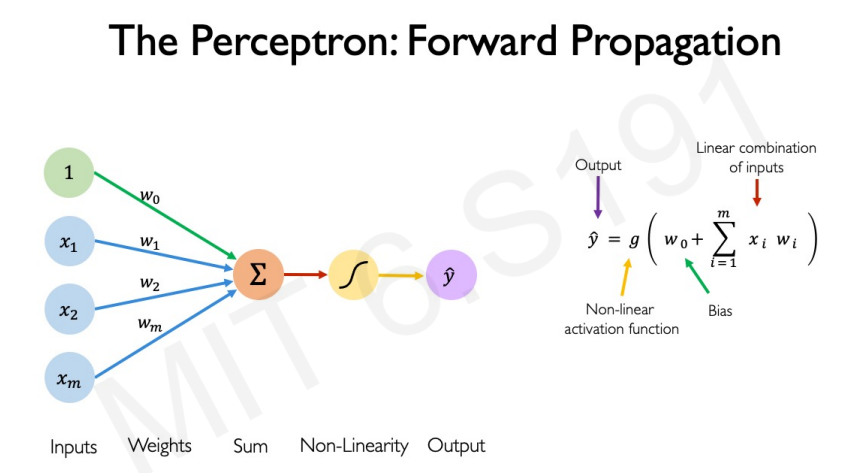

# Neural Network From Scratch

The purpose of this repo was to get a better understanding of how neural networks works under the hood, and what better way to do that than implementing one from scratch without using any ML/DL frameworks like Pytorch and Tensorflow.

On this repo you can find two implementation of this network, one in Python using numpy and one in C++ using only the Cpp standard library.

Implementing the network in Python first allows to understand the fundamentals concept of neural networks and the maths behind. In the second time building it without numpy (in C++ but it can be any other languages) make you appreciate what a lib like numpy brings you and helps you understand how a simple operation like matrix multiplication can play such an important role for neural networks and have a significant impact on their performance both in inference and in training.

### Neural Net learning process

First init networks parameters i.e: weights and biases (can be done randomly or with specific values)

1. **Forward pass** (Compute output using input data and networks parameters)
2. **Calcuate loss** (Compare predicted output with ground truth/labels)
3. **Backward pass (Backpropagation)** (Compute gradients of loss with respect to weights)
4. **Update weights**
5. Repeat (over multiples epochs)

#### Forward Pass

###### Forward pass formula

$$
    \hat{y} =  g(\sum_{i=1}^{n} x_i w_i + b) 
$$

where: 
- $w_i$ : are weights
- $x_i$ : are inputs
- $b$ : is the bias
- $g$ : is a non-linear activation function

### Keywords and Definition

#### Epoch 

An epoch is one **complete pass** through the entire training dataset by the neural network.

#### Neural Network

Is a **mathematical function** that take an input x, return an output y (predicted output) and that is parametrized by Weights (w) and biases(b)

