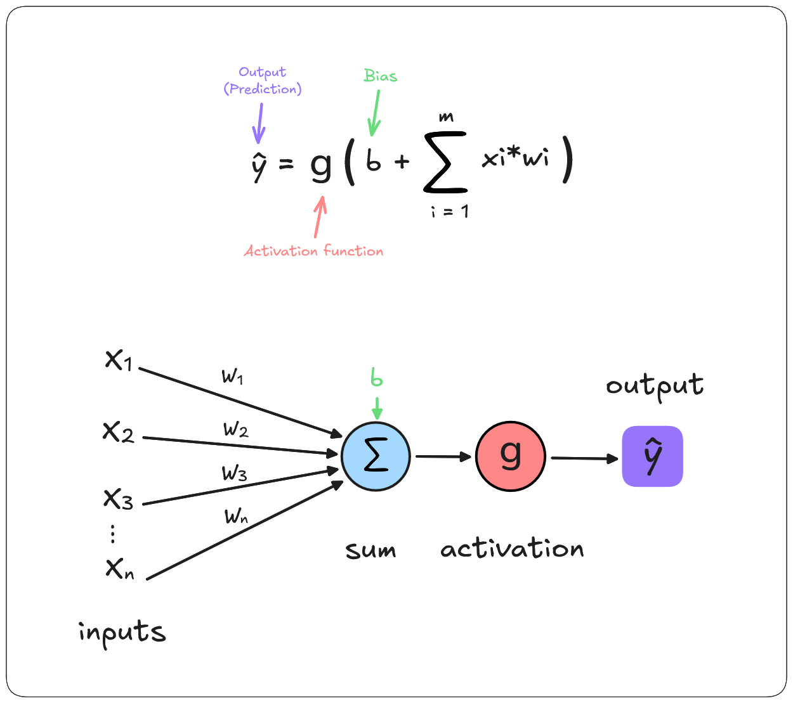

# Neural Network From Scratch

This repo was created to better understand how neural networks work by building one from scratch without using ML/DL frameworks like PyTorch or TensorFlow.

Implementing the network in Python first allows to understand the fundamentals concept of neural networks and the maths behind. In the second time building it without numpy (in C++ but it can be any other languages) make you appreciate what a lib like numpy brings you and helps you understand how a simple operation like matrix multiplication can play such an important role for neural networks and have a significant impact on their performance both in inference and in training.

### Neural Network learning process

First init networks parameters i.e: weights and biases (can be done randomly or with specific values)

1. **Forward pass** (Compute output using input data and networks parameters)
2. **Calcuate loss** (Compare predicted output with ground truth/labels)
3. **Backward pass (Backpropagation)** (Compute gradients of loss with respect to weights)
4. **Update weights (Gradient descent)** It involves substracting the gradient multiplied by the learning rate from the current parameters values (parameters which are weights and biases)
5. Repeat (over multiples epochs)

After these steps the weights and biases of the model should have been updated in order to approximate

### 1. Forward Pass

###### Forward pass formula

$$
    \hat{y} =  g(\sum_{i=1}^{n} x_i w_i + b) 
$$

where: 
- $w_i$ : are weights
- $x_i$ : are inputs
- $b$ : is the bias
- $g$ : is a non-linear activation function

### 2. Calculate Loss

In this step we compute the the loss of our model, i.e. the difference between our model's prediction and the expected value, which gives us an indication of how our model has “performed”. 

The lower the cost is the better our model as performed 

> Remember, the final goal is to have a model that achieves the lowest possible loss. 

## Keywords and Definition

#### Epoch 

An epoch is one **complete pass** through the entire training dataset by the neural network.

#### Neural Network

Is a **mathematical function** that take an input x, return an output y (predicted output) and that is parametrized by Weights (w) and biases(b)

#### Gradient Descent

It is an optimization algorithm for finding out the local minima of a differentiable function,
it helps us to find the best parameters (weights and biases) for our model.

---

3 way of doing Gradient descent

#### Stochastic Gradient Descent (SGD)

?

#### Mini-Batches Gradient Descent

? 

#### Batch Gradient Descent

?

### Loss Function

#### Categorial Cross-Entropy

### Categorical Cross-Entropy Loss

The Categorical Cross-Entropy Loss is calculated as:

### Categorical Cross-Entropy Loss

The Categorical Cross-Entropy Loss is calculated as:

$$
L = -\sum_{i=1}^{C} y_i \cdot \log(p_i)
$$

Where:
- $L$ is the loss to minimize during training.
- $C$ is the number of classes (e.g., $C = 10$ for digits 0-9).
- $y_i$ is the true label for class $i$ (one-hot encoded, i.e., $y_i = 1$ for the true class, and $y_j = 0$ for all other $j \neq i$).
- $p_i$ is the predicted probability for class $i$, usually obtained from the Softmax function.

### Purpose:
- This loss function measures how well the model's predicted probabilities align with the true labels. It is used in classification tasks, especially when the output layer of the model uses the Softmax activation function.

### Divers

The purpose of Deep Learning and training neural network is to do "function approximation"