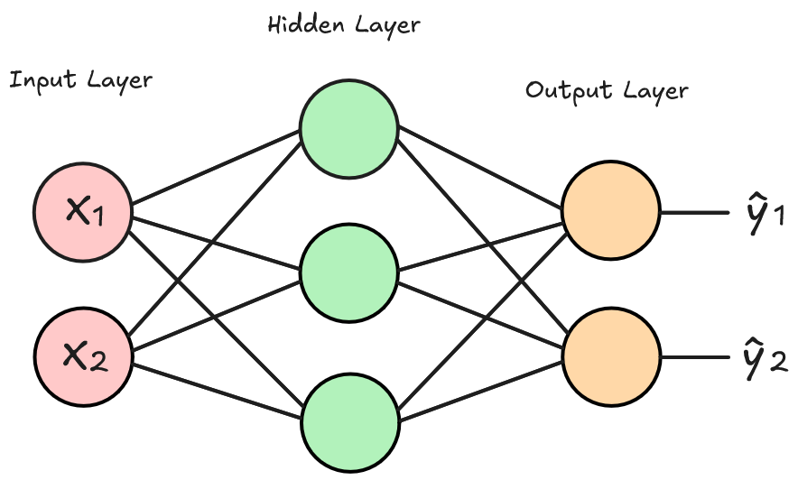
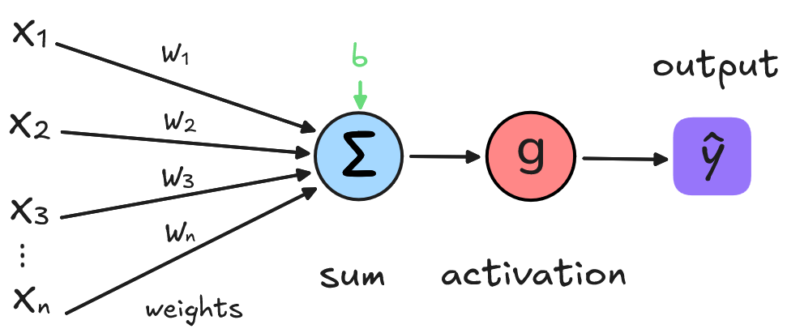
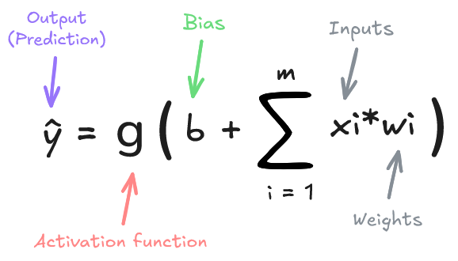

# Neural Network From Scratch

Personnal learning project implementing from scratch a Multi-Layer Perceptron (MLP) with some concise explanations of machine learning concepts.

### Files

`mlp.py` : A pure Python MLP implementation, no libs, just raw python and calculus which allows to deeply understand the maths behind Neural Networks.

`numpy_mlp.py` : Implementation using numpy, which is more representative of what you can find behind popular ML framework, which improve **A LOT** the training speed performances by taking advantages of vectorization (and GPU).

## What Is a Neural Network ? 

A Neural Network is **mathematical function** that take inputs $x$, return outputs $ŷ$ _(predicted output)_ and that is **parametrized by weights $w$ and biases $b$**

A neural network is essentially a composition of functions. Each layer transforms its input, and passes it to the next.

## Training a Neural Network

Training involves adjusting the weights and biases so the model predictions better match the expected outputs.

### Main steps in training

First: networks parameters (weights and biases) must be initialized (using a specific technique or randomly)o

0. **Initialize parameters** : Set weights and biases

1. **Forward pass** : Pass data through the network to compute predicted output $\hat{y}$

2. **Calcuate loss** : Measure how far $\hat{y}$ is from the true label $y$

3. **Backward pass (Backpropagation)** : compute gradients of loss with respect to each parameters of the model 

4. **Update weights (Gradient descent)** : update parameters using  computed gradients.  

5. **Repeat** : from step one, over the data multiple times (epochs)

After these steps the weights and biases of the model should have been updated in order to minimize the loss function and improve the model's predictions.

## Forward Pass

Each Neuron computes a weighted sum of its inputs, adds a bias, and applies an activation function:

#### Forward pass formula of a Neuron

 

Sometimes letters $z$ and $a$ are used in formula

- $z$ is the **pre-activation** output the reuslt of the weighted input plus bias:

$$
z = \sum_{i=1}^{n} x_i w_i + b
$$

- $a$ is the activation output, the result after applying the activation functon to $z$: 

$$
a = g(z)
$$

### Activation functions

Activation functions add non-linearity to the network, enabling it to model complex patterns.

Key properties:

- Non-linear (to model complex relationships)
- Differentiable (to enable gradient-based optimization)

Common examples:

- ReLU: $`f(x) = \max(0, x)`$
- Sigmoid: Good for binary output (0-1)
- Softmax: Turns logits into probabilities (for multi-class output)

### Weights

Weights are values that defines how much influence the input will have on the output. When the inputs are transmitted between neurons, the weights are applied to the inputs along with an additional value (the bias).

### Bias

Added to the weighted input before the activation function is applied. It help models represent patterns that do not necessarily pass through the origin.

## Calculate loss

The loss function measures how well the network's predictions match the actual labels.

The result is a **scalar value** that tells us how well the network performed (The lower the loss, the better the prediction).

### Compute gradients w.r.t to $\hat{y}$

At this step we also compute the derivate of the loss function with respect to the network output: 

Gradient of the loss w.r.t. the output $\hat{y}$ :

$$ 
\frac{\partial \mathcal{Loss}}{\partial \hat{y}} = \nabla_{\hat{y}} \mathcal{L} = \text{grad}_{\text{out}} \quad 
$$

This gradient $grad_{out}$  is what we use ot initiate the backpropagation.

_See this section [Loss Function](#loss-function) to know more about this subject._

## Backpropagation & Gradients

### Why do we compute derivatives?

To optimize our network (minimize the loss), we need to know how much each weight and bias contributes to the error. Derivatives tell us this.

A derivative measures how much a function's output changes for a small change in input.

In neural nets, we compute partial derivatives of the loss function with respect to every parameter (weights and biases).

### Role of the Chain Rule

Neural networks are a composition of functions (layer outputs become inputs to the next).

The chain rule lets us compute the derivative of the full network by multiplying the derivatives layer by layer.

This is exactly what happens during backpropagation.

_See [Chaine Rule](#chain-rule)_

### Backpropagation example

1. Compute gradient w.r.t to network output $\hat{y}$:

$$
grad_{out} = \frac{\partial L}{\partial \hat{y}}
$$

2. Then we pass $grad_{out}$ to the previous layer, which will then compute the activation gradient: 

$$
grad_z = \frac{\partial \mathcal{L}}{\partial z} = \frac{\partial \mathcal{L}}{\partial a} \cdot \frac{\partial a}{\partial z}
$$

3. Weight gradient:

$$
grad_w = \frac{\partial \mathcal{L}}{\partial w} = \frac{\partial \mathcal{L}}{\partial z} \cdot \frac{\partial z}{\partial w} = \text{grad}_z^\top \cdot x
$$

4. Bias gradient

$$
\frac{\partial \mathcal{L}}{\partial b} = \frac{\partial \mathcal{L}}{\partial z} \cdot \frac{\partial z}{\partial b} = \frac{\partial \mathcal{L}}{\partial z} \cdot 1 = \frac{\partial \mathcal{L}}{\partial z}
$$

5. Finally input gradient, which will then be passed to the previous layer 

$$
grad_x = \frac{\partial \mathcal{L}}{\partial x} = \frac{\partial \mathcal{L}}{\partial z} \cdot \frac{\partial z}{\partial x} = \text{grad}_z \cdot W
$$

## Gradient Descent & Training Strategies
### Gradient Descent

An optimization algorithm used to minimize the loss by updating weights in the opposite direction of the gradient.

Gradient: tells us how to change weights to decrease the loss

Update step: $w_{t+1} = w_{t} - \eta \cdot \frac{\partial L}{\partial w}$

The gradient points in the direction of steepest ascent (increase), but we want to minimize the loss (cost) function. So we go in the opposite direction of the gradient.

### Training Strategies

A training strategy is how to feed the data and manage updates

#### Stochastic Gradient Descent (SGD)

- Updates weights using one training sample at a time
- Fast, but noisy

#### Mini-Batch Gradient Descent

- Updates weights using a small batch of samples
- Most common in practice (e.g., batch size 32, 64)
- Efficient and compatible with GPU

#### Batch Gradient Descent

- Uses the entire dataset to compute gradients
- Accurate, but slow and memory-intensive

> Faster execution time:  Batch > Mini-Batch > Stochastic 

> Batch & Mini-Batch enable vectorized computation, speeding things up significantly.

> If loss function is **non-convex** (has more than one local minima) Batch gradient can get stuck in local minima.

## Important Concepts

### Epoch

One complete pass through the entire training dataset.

### Gradients 

A gradient is a vector that stores the partial derivatives of multivariable functions.

Here we have a multi-variable function $f(x, z)$ and here is it's gradient:  

$$
\nabla f(x, z) = 
\begin{bmatrix}
\frac{\partial f}{\partial x} \\
\frac{\partial f}{\partial z}
\end{bmatrix}
$$

Note:
- If gradient > 0 → increasing param increases loss
- If gradient < 0 → increasing param decreases loss

### Derivative

The derivative of a function tells us about the rate of change in that function at a particular input value.

Measures how much a function’s output changes when the input changes. 

If $f(x)$ is increasing at $a$, the derivative of $f(x)$ at $a$ or $f'(x)$ is **positive**

If $f(x)$ is decreasing at $a$, the derivative of $f(x)$ at $a$ or $f'(x)$ is **negative**

#### Derivative formula:
$$
f'(x) = \frac{df}{dx} = \lim_{h  \to 0} \frac{f(x + h) - f(x)}{h}
$$

#### Geometric intuition

The derivative of a function at some input is equal to the slope of the tangent line at that point.

### Chain Rule 
If a function is a composition like $f(g(x))$, the derivative is:

$$
\frac{df}{dx} = \frac{df}{dg}\times \frac{dg}{dx}
$$

### One-Hot Encoding

Represents categorical values as binary vectors.
Example:
Label 2 out of 4 classes →  `[0, 0, 1, 0]`

## Loss Function

### Categorical Cross-Entropy Loss

$$
L = -\sum_{i=1}^{C} y_i \cdot \log(p_i)
$$

Where:
- $L$ is the loss 
- $C$ is the number of classes (e.g., $C = 10$ for digits 0-9).
- $y_i$ is the true label for class $i$ (one-hot encoded, i.e., $y_i = 1$ for the true class, and $y_j = 0$).
- $p_i$ is the predicted probability for class $i$

### Purpose

This loss function measures how well the model's predicted probabilities align with the true labels. It is used in classification tasks, especially when the output layer of the model uses the Softmax activation function.

### Softmax

Math function that converts a vector of values (referred as logit) into a probability distribution.

Converted values are ranging between [0, 1] and the sum of all the values in the vector are equals to 1.

Used in mulit-class classification (like MNIST) to transform output of the neural net (logits) into interpretable probabilities.

## Resources

Great learning resources I used :

- [Machine Learning Glossary](https://ml-cheatsheet.readthedocs.io)
- [Andrej Karpathy YTB channel](https://www.youtube.com/watch?v=VMj-3S1tku0)
- [Neural Networks and Deep Learning](http://neuralnetworksanddeeplearning.com/index.html)
- [Incredible visual explanation : 3Bule1Brown](https://www.youtube.com/@3blue1brown)